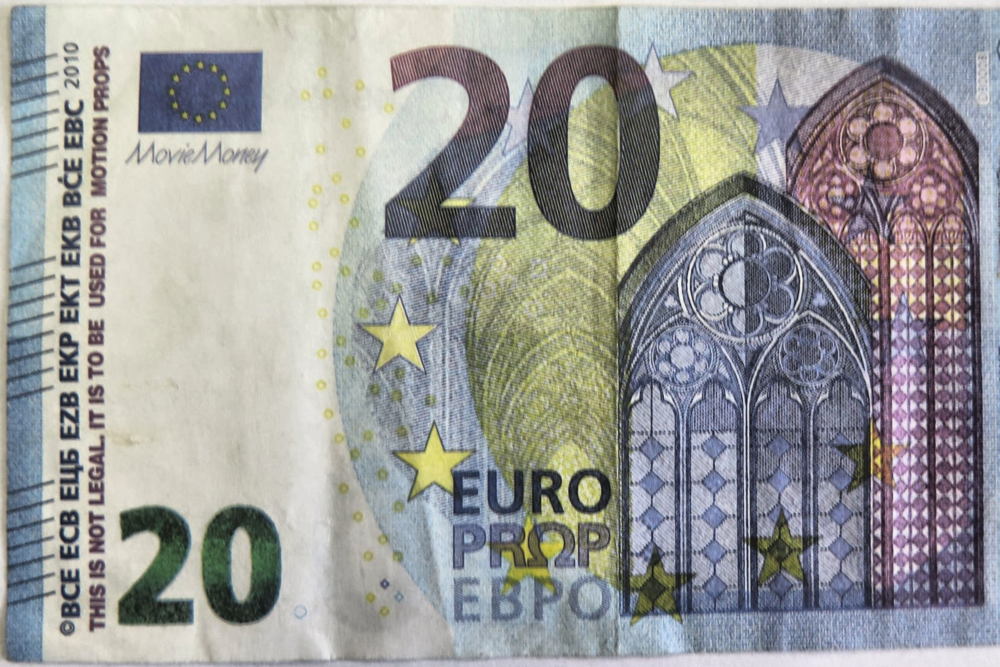
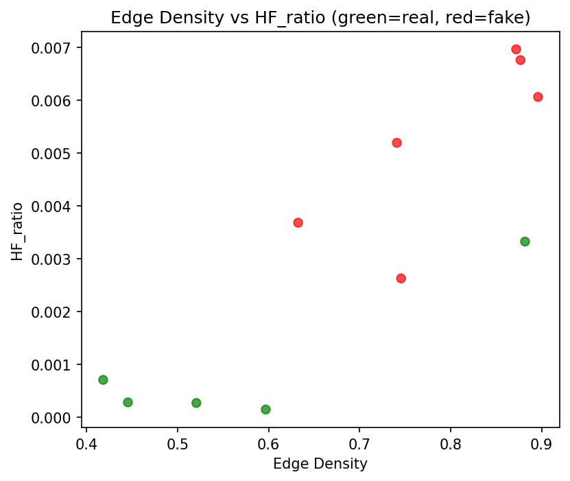

# Banknote Verifier – Echt vs Vals Geld Herkenning 
**Laatste update:** 2025-12-03  

## Groepsleden
- Emiel Mangelschots  
- Bjarni Heselmans  

---

## Projectdoel
Dit project heeft als doel een systeem te ontwikkelen dat met een **webcam** of **camera via microcontroller** kan bepalen of een bankbiljet **echt of vals** is.  
In tegenstelling tot machine learning- of deep learning-benaderingen maken wij **uitsluitend gebruik van klassieke image processing-technieken**, waaronder:
- Kleurconversies (RGB → HSV)
- Histogram equalization (CLAHE) en gamma-correctie
- Low-pass filtering (ruisonderdrukking)
- **Edge detection (Sobel / Canny)**
- Frequentiedomeinanalyse (FFT)
- Textuuranalyse via Gabor- en Laplacian-filters

Echte biljetten vertonen specifieke **microstructuren en patronen** die vervalsingen missen.  
Door deze kenmerken te analyseren en te kwantificeren kunnen we het biljet classificeren als “**waarschijnlijk echt**” of “**waarschijnlijk vals**”.

---

## Overzicht van de methode

Globale pipeline:

1. Beeldverwerving (webcam / camera / dataset)
2. Voorbewerking (Preprocessing)
3. Edge-analyse (Canny, Laplacian + Canny, Gabor)
4. FFT-analyse (HF_ratio, PeakCount)
5. Feature-extractie en opslag naar CSV
6. **Regelgebaseerde classificatie** (Echt / Nep)
7. Visualisatie van features en prestaties (plots)

De implementatie gebeurt vooral in:
- `Software/main.py`
- `Software/scripts/Preprocessing.py`
- `Software/scripts/Edges.py`
- `Software/scripts/FFT_analysis.py`
- `Software/scripts/Classification.py`

---

### 1. Beeldverwerving
- Input via webcam of microcontroller (bijv. Raspberry Pi).
- Biljetten worden op een egale achtergrond geplaatst onder constante belichting.
- Beelden worden vastgelegd in RGB-formaat (8-bit per kanaal).

---

### 2. Voorbewerking
Doel: stabiliseren van belichting, verbeteren van contrast en ruisonderdrukking.

| Stap | Methode | Reden / Verwachte effect |
|------|----------|--------------------------|
| Kleurconversie | RGB → HSV | Scheidt helderheid (Value) van kleurtint (Hue), robuuster tegen belichting. |
| Contrastverbetering | CLAHE (Contrast Limited Adaptive Histogram Equalization) | Verhoogt lokaal contrast, maakt randen beter zichtbaar. |
| Ruisonderdrukking | Gaussian blur (σ = 0.5–2) | Vermindert hoge-frequentieruis en stabiliseert randdetectie. |

De voorbewerkte beelden worden opgeslagen in Output/real/ en Output/fake/.



---

## 3. Edge Detection – Analyse van micropatronen
Een cruciaal onderdeel van de *Banknote Verifier* is het detecteren van **randen en microstructuren** die kenmerkend zijn voor echte biljetten.  
Hiervoor werden twee klassieke methoden onderzocht: **Sobel Edge Detection** en **Canny Edge Detection**.

---

### 3.1 Sobel Edge Detection

#### Doel
De **Sobel-operator** wordt toegepast op de voorbewerkte beelden om **intensiteitsveranderingen** in horizontale en verticale richting te meten. Hiermee worden **microprintlijnen en structuren** zichtbaar die typisch zijn voor echte biljetten.

#### Werking
De gradiënten in X- en Y-richting worden gecombineerd via:

\[ M(x, y) = \sqrt{(G_x^2 + G_y^2)} \]

```python
sobel_x = cv2.Sobel(gray, cv2.CV_64F, 1, 0, ksize=3)
sobel_y = cv2.Sobel(gray, cv2.CV_64F, 0, 1, ksize=3)
sobel_magnitude = cv2.magnitude(sobel_x, sobel_y)
sobel_magnitude = cv2.normalize(sobel_magnitude, None, 0, 255, cv2.NORM_MINMAX)
```

**Parameterkeuze:**
- ksize=3 – behoudt fijne details in bankbiljettexturen.
- cv2.CV_64F – voorkomt verlies van negatieve gradiënten.
- Vooraf lichte Gaussian blur (σ=0.5) om ruis te beperken.

**Resultaten:**
- Echte biljetten: dichte, scherpe randstructuren.  
- Valse biljetten: zachtere, diffuse randen.

De output wordt opgeslagen in Output/Sobeledge/real/ en Output/Sobeledge/fake/.

---

### 3.2 Canny Edge Detection

#### Doel
De **Canny Edge Detector** is een meerstapsmethode die geschikt is voor **precieze randdetectie met lage ruisgevoeligheid**.  
Ze combineert smoothing, gradiëntanalyse, non-maximum suppressie en hysterese-drempeling.

#### Werking
1. **Voorbewerking:** CLAHE + bilateraal filter (behoudt randen, verwijdert ruis).  
2. **Adaptieve drempels:** op basis van de mediaan van pixelintensiteiten:

\[ lower = 0.66 × median, \quad upper = 1.33 × median \]

3. **Randextractie:**
```python
edges = cv2.Canny(smooth, lower, upper, apertureSize=3, L2gradient=True)
```
4. **Nabewerking:** morfologische sluiting en dilatie om randen te versterken.

**Resultaten:**
- Echte biljetten: rijke, consistente microstructuren.  
- Valse biljetten: minder detail, lagere randdichtheid.

De resultaten worden opgeslagen in Output/Cannyedge/.

---

### 3.3 Vergelijking Sobel vs Canny

| Kenmerk | Sobel Edge | Canny Edge |
|----------|-------------|------------|
| Complexiteit | Eenvoudig, lineair filter | Gecombineerde meerstapsanalyse |
| Ruisgevoeligheid | Matig | Laag (inclusief smoothing & hysterese) |
| Randnauwkeurigheid | Goed bij sterke randen | Uitstekend, ook bij subtiele structuren |
| Geschiktheid voor biljetanalyse | Snel, minder detail | Precisie, textuurbehoud, stabiel resultaat |

**Conclusie:**  
Voor het *Banknote Verifier*-project is **Canny Edge Detection** gekozen als hoofdalgoritme vanwege de hoge precisie en ruisbestendigheid.  
**Sobel Edge** blijft echter waardevol als referentiemethode en voor snelle testen.

---

### 3.4 Resultaten – Edge Density Analyse

#### Doel
De **edge density** (randschadichtheid) meet hoeveel randen (intensiteitsveranderingen) aanwezig zijn in een beeld, relatief ten opzichte van het totaal aantal pixels. Dit geeft een kwantitatieve indicatie van de **complexiteit en fijnheid van microstructuren** in het biljet.

\[ \text{Edge Density} = \frac{\text{Aantal randpixels}}{\text{Totaal aantal pixels}} \]

```python
edges = cv2.Canny(gray, lower, upper)
edge_density = np.sum(edges > 0) / edges.size
```

Echte biljetten bevatten veel fijne druklijnen en texturen, waardoor ze een **meer gebalanceerde en consistente randstructuur** hebben.  
Valse biljetten daarentegen vertonen vaak **onnatuurlijke contrasten** of **ruisachtige randen** door inferieure printkwaliteit.

---

### Tabel met gemeten waarden

| Type | Bestandsnaam | EdgeDensity | Interpretatie |
|------|---------------|--------------|----------------|
| real | 10euroReal.png | 0.0052 | Zeer lage randdichtheid – homogeen oppervlak. |
| real | 200euroReal.png | 0.0265 | Gematigde randdichtheid – duidelijke structuren zichtbaar. |
| real | 20euroReal.png | 0.0206 | Typisch echt biljet – goed detailcontrast. |
| real | 50euroReal.png | 0.0118 | Lage randdichtheid – mogelijk zachte belichting. |
| real | 5euroReal.png | 0.0288 | Hoogste echte waarde – sterke textuurdetails. |
| fake | 100euroFake.png | 0.0138 | Laag, mogelijk goed nagemaakte vervalsing. |
| fake | 10euroFake.png | 0.0358 | Hoog – onnatuurlijke patronen of ruis. |
| fake | 200euroFake.png | 0.0574 | Zeer hoog – printartefacten aanwezig. |
| fake | 20euroFake.png | 0.0824 | Extreem hoog – overmatige ruis, slechte kwaliteit. |
| fake | 50euroFake.png | 0.0412 | Hoog – inconsistente randen. |
| fake | 5euroFake.png | 0.0554 | Hoog – diffuse randen typisch voor vervalsing. |

---

### Statistische vergelijking

| Categorie | Gemiddelde Edge Density |
|------------|-------------------------|
| Echte biljetten | **0.0186** |
| Valse biljetten | **0.0476** |

**Valse biljetten hebben gemiddeld ~2,5× hogere edge density** dan echte biljetten.  
Dit duidt op een groter aantal scherpe overgangen en visuele ruis.

---

### Interpretatie
- **Echte biljetten:** lage, consistente edge density → verfijnde microdruk en uniforme oppervlakken.  
- **Valse biljetten:** hoge edge density → overmatige randen, printartefacten of contrastruis.

Deze resultaten bevestigen dat **edge density** een nuttige metriek is voor het onderscheiden van echte en valse biljetten.

---

### 3.5 Gecombineerde Edge Detection (Laplacian + Canny)

#### Doel
Om zowel **fijne texturen** als **duidelijke contouren** in biljetten te isoleren, werd een gecombineerde aanpak getest:  
1. **Laplacian filter** – versterkt kleine intensiteitsvariaties en microtexturen.  
2. **Canny edge detection** – detecteert de sterke, consistente randen in dat versterkte beeld.

#### Resultaten
Vergelijking van echte en valse biljetten (voorbeeld: €5):

| Type | Observatie | Interpretatie |
|------|-------------|---------------|
| **5euroReal_edges_combined.png** | Minder dicht netwerk van randen, goed afgelijnde structuren, dunne contouren. | Echt biljet: verfijnde druk en gecontroleerde microstructuren. |
| **5euroFake_edges_combined.png** | Zeer dicht patroon, kruisingen en textuurvulling, ruisachtig effect. | Vals biljet: onnatuurlijke, onregelmatige patronen door inferieure print. |

#### Conclusie
De combinatie van **Laplacian + Canny** vergroot het contrast tussen echte en valse biljetten:
- Laplacian benadrukt de textuurverschillen.  
- Canny filtert de relevante contouren uit deze textuurinformatie.  

Visueel én kwantitatief (hogere edge density bij valse biljetten) bevestigt deze methode dat de **microstructuren van echte biljetten consistenter en minder chaotisch** zijn.

---

## 4. Frequentiedomeinanalyse (FFT)
Een **2D Fast Fourier Transform (FFT)** wordt toegepast op de grijswaardenversie van het biljet.  
Door de energieverdeling in het frequentiedomein te analyseren kunnen drukpatronen herkend worden:
- **Echte biljetten:** duidelijke ringstructuren of pieken in hoge frequenties.  
- **Valse biljetten:** energie geconcentreerd in lage frequenties (vlak beeld).

**Metrieken:**
- **HF_ratio:** verhouding hoge-frequentie-energie tot totale energie.  
- **peak_count:** aantal significante pieken in het spectrum.

---

## 5. Classificatie (Echt / Vals)
Een eenvoudige **regelgebaseerde beslissingsfunctie** bepaalt de classificatie:

```python
if (edge_density > threshold1) and (HF_ratio > threshold2):
    label = "Echt"
else:
    label = "Vals"
```

De drempelwaarden worden experimenteel vastgesteld aan de hand van echte en valse biljetten.

---

## 6. Regelgebaseerde Classificatie (Echt / Nep)

Dit is de kern van de eerste classifier: op basis van gemeten features (`HF_ratio` en `edge_density`) een beslissing maken of een biljet waarschijnlijk echt of vals is.

Bestand: [Classification.py](./Software/scripts/Classification.py) → `classify_rule_based`  
Aangeroepen vanuit: [main.py](./Software/main.py)

### 6.1 Beslislogica

Uit de gemeten data blijkt:

- Echte biljetten hebben over het algemeen een **lage HF_ratio**.
- Valse biljetten hebben een **hogere HF_ratio**.
- Daarnaast hebben valse biljetten vaak een **hogere edge_density** dan echte.

Daarom gebruiken we een eenvoudige, maar effectieve beslisregel met twee stappen:

1) Hoofdregel op basis van HF_ratio  
- Als `HF_ratio ≤ 0.003` → biljet wordt geclassificeerd als **“Echt”**  
- Als `HF_ratio > 0.003` → biljet wordt geclassificeerd als **“Nep”**

2) Correctie in de twijfelzone met edge_density  
- Twijfelzone: `|HF_ratio − 0.003| < 0.001`  
- Als in die zone ook `edge_density > 0.70` is, dan wordt het biljet als **“Nep”** geclassificeerd (override), omdat de structuur dan sterk lijkt op de valse voorbeelden.

In pseudocode:
```
def classify_rule_based(edge_density, hf_ratio,t_hf=0.003,t_ed_high=0.70)
# Stap 1: hoofdregel op HF_ratio
if hf_ratio <= t_hf:
    prediction = "Echt"
else:
    prediction = "Nep"

# Stap 2: twijfelzone corrigeren met edge_density
if abs(hf_ratio - t_hf) < 0.001:
    if edge_density > t_ed_high:
        prediction = "Nep"

# Stap 3: eenvoudige confidence-score
base_conf = min(abs(hf_ratio - t_hf) / 0.003, 1.0)
# (in de code wordt hier nog een kleine bonus toegepast 
# als edge_density “consistent” is met de voorspelling)
confidence = base_conf  # vereenvoudigd

return prediction, confidence
```

De thresholds worden in `main.py` gedefinieerd als:
```
THRESHOLD_HF_RATIO = 0.003
THRESHOLD_EDGE_DENSITY_HIGH = 0.70
```

En zo aangeroepen:
```
prediction, confidence = classify_rule_based(
density,
hf_ratio,
t_hf=THRESHOLD_HF_RATIO,
t_ed_high=THRESHOLD_EDGE_DENSITY_HIGH
)
```

### 6.2 Intuïtieve uitleg

- Eerst kijken we naar **HF_ratio**:
  - laag → typisch echt
  - hoog → typisch vals
- Als de HF_ratio heel dicht bij de grens ligt, wordt **edge_density** gebruikt om extra context te geven:
  - hoge edge_density in de twijfelzone → eerder vals

Zo krijgen we een eenvoudige maar verklaarbare classifier die expliciet steunt op twee interpreteerbare features.

---

## 7. Visualisaties en eerste resultaten

Om de methode en de resultaten inzichtelijk te maken, worden de gemeten waarden en prestaties gevisualiseerd met Matplotlib.  
De plots worden automatisch gegenereerd in [plots](./Output/plots/) wanneer `main.py` wordt uitgevoerd.

### 7.1 Scatterplot: EdgeDensity vs HF_ratio

Bestand:  
`Output/plots/scatter_edge_hf.png`

In deze plot wordt voor elk biljet de relatie tussen edge_density en HF_ratio getoond:

- x-as: `Edge_Density`
- y-as: `HF_ratio`
- kleur:
  - groen = echte biljetten (`real`)
  - rood = valse biljetten (`fake`)



Interpretatie:

- Valse biljetten hebben gemiddeld een **hogere edge_density** dan echte biljetten.
- Dit bevestigt dat edge_density nuttig is als extra signaal, vooral in twijfelgevallen rond de HF-ratio-drempel.

---

### 7.3 Accuracy-plot

Bestand:  
`Output/plots/accuracy.png`

Deze plot toont de totale classificatie-accuracy als een eenvoudige balkgrafiek (0–1).

Huidige resultaten op de gebruikte dataset:

- Totale voorspellingen: 11
- Correcte voorspellingen: 10
- Accuracy: **90.91%**

Deze waarde wordt ook in de terminal weergegeven na het draaien van `main.py`.

---

## 8. Evaluatie & Verwachte resultaten
| Metriek | Beschrijving | Doelwaarde |
|----------|---------------|------------|
| Edge density verschil | Gemiddeld verschil tussen echte en valse biljetten | > 20% |
| HF-ratio verschil | Verschil in hoge-frequentie-energie | > 15% |
| Classificatienauwkeurigheid | Correcte voorspellingen op testset | ≥ 80% |

Daarnaast worden foutieve classificaties en randvoorbeelden geanalyseerd om de beperkingen van het systeem te bespreken.

---

## 9. Overwogen alternatieven
| Stap | Alternatief | Waarom (nog) niet gekozen |
|------|--------------|----------------------------|
| Edge detection | Laplacian of Scharr filter | Eventueel alternatief bij overgevoeligheid van Canny. |
| Frequentieanalyse | Wavelet-transformatie | Interessant, mogelijk in latere fase. |
| Belichtingscorrectie | Retinex / homomorphic filtering | Wordt onderzocht als geavanceerde uitbreiding. |

---

## Tools & afhankelijkheden
- Python 3.12+
- OpenCV – beeldbewerking en filtering
- NumPy / SciPy – wiskundige berekeningen en FFT
- Matplotlib – visualisatie
- (Optioneel) Raspberry Pi + camera-module

---

## Installatie & gebruik
```bash
# 1. Clone de repository
git clone https://github.com/<jullie-gebruikersnaam>/banknote-verifier.git

# 2. Installeer vereiste pakketten
pip install -r requirements.md

# 3. Start de applicatie
python main.py
```

---

## Toekomstige uitbreidingen
- Automatische herkenning van biljetwaarde (€5, €10, €20, …)
- Real-time detectie via live camera
- Analyse onder verschillende lichtcondities
- Integratie van een eenvoudige machine learning-classifier
- Edge-density en HOG-analyse als aanvullende metrieken

---

## Bronnen
- Slides Image Processing – Dr. Ing. Koen Gilissen  
- OpenCV Documentation  
- Gonzalez & Woods, *Digital Image Processing*, 4th Edition  

---

## Contributoren
- **Emiel Mangelschots** – _Student_ – [GitHub](https://github.com/empel06)  
- **Bjarni Heselmans** – _Student_ – [GitHub](https://github.com/BjarniHeselmans)
